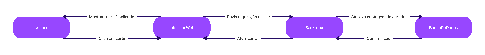

# ShieldFolio

Link do pdf:
https://github.com/luisaassilva/Documentacao-de-Projeto-ShieldFolio/blob/1a24a6cfe4e6d561835fd227717ab1225463e7f7/Trabalho%202%20-%20Documentacao_de_Projeto_ShildFolio.pdf

## Documentação de Projeto

**Versão 1.0**      

Projeto de sistema elaborado pelo(s) aluno(s):
Alunas Participantes:
* Luisa Clara de Paula Lara Silva
* Maria Clara de Oliveira Silva
* Debora Campos Sigaud
Data da criação 20-05-2025

## Tabela de Conteúdo
1. [Introdução](#1-introdução)         
2. [Modelos de Usuário e Requisitos](#2-modelos-de-usuário-e-requisitos)             
   2.1 [Descrição de Atores](#21-descrição-de-atores)          
   2.2 [Modelo de Casos de Uso e Histórias de Usuários](#22-modelo-de-casos-de-uso-e-histórias-de-usuários)               
   2.3 [Diagrama de Sequência do Sistema e Contrato de Operações](#23-diagrama-de-sequência-do-sistema-e-contrato-de-operações)            
3. [Modelos de Projeto](#3-modelos-de-projeto)           
   3.1 [Arquitetura](#31-arquitetura)           
   3.2 [Diagrama de Componentes e Implantação](#32-diagrama-de-componentes-e-implantação)          
   3.3 [Diagrama de Classes](#33-diagrama-de-classes)           
   3.4 [Diagramas de Sequência](#34-diagramas-de-sequência)          
   3.5 [Diagramas de Comunicação](#35-diagramas-de-comunicação)           
   3.6 [Diagramas de Estados](#36-diagramas-de-estados)           
4. [Modelos de Dados](#4-modelos-de-dados)

## Histórico de Revisões

| Nome | Data | Razões para Mudança | Versão |
|---|---|---|---|
| Luisa Clara | 29/05/25 | Criação do documento e escrita do docs e md| 1.0 |
| Maria Clara | 29/05/25 | criação de diagramas casos de uso e sequencia| 1.0 |
| Debora | 29/05/25 | criação de diagramas comunicação e estado | 1.0 |

## 1. Introdução
Este documento agrega: 
1) a elaboração e revisão de modelos de domínio
2) modelos de projeto para o sistema ShieldFolio.

* Atualmente, artistas digitais enfrentam desafios significativos ao compartilhar suas obras online, especialmente em relação à proteção contra o uso não autorizado por Inteligência Artificial. Muitos sistemas de portfólio não oferecem mecanismos eficazes de proteção ou controle de privacidade, deixando as imagens vulneráveis a uso indevido, cópia ou extração por modelos de IA generativa. O sistema proposto é uma plataforma web voltada à exposição e gerenciamento de portfólios artísticos, com foco em segurança de imagens, organização personalizada e integração social.

## 2. Modelos de Usuário e Requisitos              

### 2.1 Descrição de Atores

* Artistas: Usuário principal do sistema. Pode criar conta, enviar imagens com proteção anti-IA, organizá-las em pastas, aplicar tags, definir níveis de privacidade, e compartilhar em redes sociais. Marcar se gostaria de ver números de likes, salvos ou visualização.

* Administrador do Sistema: Responsável pela manutenção, moderação de conteúdo (como denúncias ou violação das políticas), gerenciamento de usuários e configurações do sistema.

* Visitante público (sem conta): Qualquer usuário não autenticado que acessa o site. Pode visualizar imagens públicas e navegar por portfólios (exceto os protegidos).

* Usuário logado: conseguem curtir obras, salvar obras, visualizar conteúdos privados que o artista tenha marcado.

### 2.2 Modelo de Casos de Uso e Histórias de Usuários  

#### Casos de Uso

- UC-01 -> Curtir uma imagem
- UC-02 -> Publicar uma imagem criptografada anti-ia
- UC-03 -> compartilhar em outras redes sociais
- UC-04 -> Fazer login

#### Histórias de Usuário

*  Como usuário gostaria de me cadastrar para que tenha acesso a novas funcionalidades
* Como artista gostaria de Adicionar tags às imagens para que facilite a pesquisa de minhas obras
* Como artista gostaria de me criar pasta de portifólio para facilitar a organização de minha obras
* Como artista gostaria de compartilhar em redes sociais para centralizar como poderia compartilhar minhas obras 
* Como artista gostaria que minha obrar ao ser publicada já esteja com proteção Anti-Ia para que não seja necessário utilizar outro software que faça isso
* Como artista gostaria de publicar imagens com senhas de privacidade para que consiga filtrar a visualização de certas obras através de apenas seguidores visualizarem ou apenas pessoas com senhas corretas
* Como visitante gostaria de visualizar imagens públicas para que o artista não seja prejudicado de apenas usuários com senha possa visualiza-la
* Como administrador gostaria gerenciar usuários para poder excluir contas
* Como administrador gostaria de gerenciar denúncias para que seja possível verificar se a denúncia esta correta ou não.
* Como administrador gostaria de remover conteúdos que infringem regras da comunidade para que a comunidade esteja sempre dentro das regras
* Como usuário logado gostaria de favoritar uma imagem para salvá-la para que não precise procurar ela facilitando o acesso a obras que gostei
* Como usuário logado gostaria de seguir meu artistas preferidos para que facilite minha busca pelos artistas que gosto
* Como usuário logado dar likes em imagens para que o artista compreenda quando gosto de uma obra

#### Diagrama de Casos de Uso

### 2.3 Diagrama de Sequência do Sistema

*  UC-01 -> Curtir uma imagem
  
| Contrato | Curtir Imagem | 
|------ | ---- |
| Operação |Curtir Imagem(idImagem)|
| Referências cruzadas | Criação da imagem |
| Pré-condições | Usuário deve estar autenticado. Imagem deve estar publicada.|
| Pós-condições | Registro de curtida é salvo. Interface do usuário é atualizada para refletir o like. | 

UC-03 -> compartilhar em outras redes sociais

| Contrato | Compartilhar Imagem | 
|------ | ---- |
| Operação |Curtir Imagem(idImagem)|
| Referências cruzadas | Caso de uso: Compartilhar imagem em redes sociais) |
| Pré-condições | Usuário deve ser o proprietário da imagem.
Imagem deve estar publicada. |
| Pós-condições |Imagem é compartilhada na plataforma externa (ex: Twitter).
Link é registrado no sistema para referência. | 

UC-02 -> Publicar uma imagem criptografada anti-ia

| Contrato | Upload Imagem Com Protecao Anti-Ia | 
|------ | ---- |
| Operação |uploadImagem(titulo, descricao, arquivo, visibilidade,tag)|
| Referências cruzadas | Caso de uso: Publicar imagem com proteção anti-IA |
| Pré-condições |Usuário deve estar autenticado.Arquivo da imagem deve estar em formato permitido (ex: JPG, PNG).|
| Pós-condições |Imagem é armazenada.Processo de proteção anti-IA é iniciado.Imagem entra em estado de "EmVerificacao".| 

## 3. Modelos de Projeto

### 3.1 Arquitetura

O sistema utiliza arquitetura em três camadas: apresentação (web/mobile), lógica de negócios (API REST), e persistência (banco de dados relacional).

#### Diagrama de Arquitetura

### 3.2 Diagrama de Componentes e Implantação

#### Diagrama de Componentes

#### Diagrama de Implantação

### 3.3 Diagrama de Classes

#### Diagrama de Classes

### 3.4 Diagramas de Sequência

### 3.5 Diagramas de Comunicação

#### UC-01 -> Curtir uma imagem

#### UC-03 -> compartilhar em outras redes sociais

#### UC-02 -> Publicar uma imagem criptografada anti-ia

### 3.6 Diagramas de Estados

### 4. Modelos de Dados

#### Diagrama Banco de Dados:     

#### Estratégias de Mapeamento:

##### Classes e Tabelas:
Cada classe do sistema vira uma tabela. Seus atributos (textos, números, datas) viram colunas com tipos compatíveis no banco. 
##### Relacionamentos: 
* Um-para-muitos (ex: Usuario com várias Imagemns): A tabela Imagem terá um idUsuario para ligar ao usuário.
* Muitos-para-muitos (ex: Imagem em várias Pastas): Usaremos uma tabela no meio (ImagemPasta) com o ID da imagem e o ID da pasta para conectá-los.
##### Herança de Usuário:
Tipos de usuário (comum, artista, admin) ficarão todos na tabela Usuario, com uma coluna tipo para diferenciá-los. 
##### Ações do Usuário:
Coisas como Compartilhamento e Curtida serão entidades atualizadas quando o usuário interagir. 
##### Regras e Validações:
Regras para manter os dados corretos (ex: e-mail único) serão definidas no banco e também no código do sistema. 
##### Outros Pontos: 
* Usaremos UUIDs como chaves primárias para garantir IDs sempre únicos.
* Colocaremos índices em colunas muito pesquisadas (email, IDs) para buscas mais rápidas.
* Imagens não ficarão no banco; guardaremos em um serviço externo (como AWS S3) e salvaremos apenas o link (caminho ou URL) no banco.

